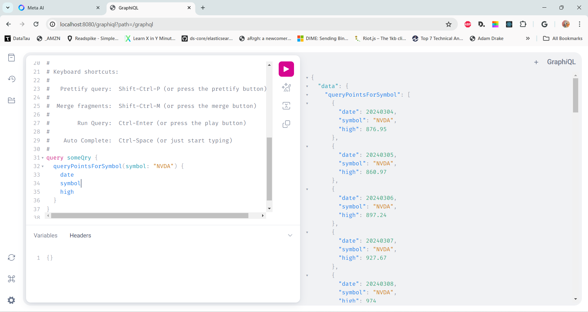

### The 'eod-service' is a Spring Boot app that:
- Hosts EOD OHLCV [stock market data](https://eoddata.com/) in an embedded [H2 database](https://www.h2database.com/html/main.html)
- Provides a REST API endpoints for /exchanges, /{exchange}/symbols
- Provides a [GraphQL](https://graphql.org/) API endpoint for accessing the historic OHLCV data for a given symbol
- Wants to support NASDAQ, NYSE and AMEX exchanges. But currently only has data (and tables) for NASDAQ.
- Demonstrates the following fun Java ecosystem features:
    - JPA with composite primary key
    - JPA with @MappedSuperclass
    - Java Records as DTOs
    - [MapStruct](https://mapstruct.org/) for mapping between Entities and DTOs
    - A shared REST and GraphQL controller
- Also provides a slightly janky loader program for copying CSV data files into the H2 database

### Example GraphQL query:
